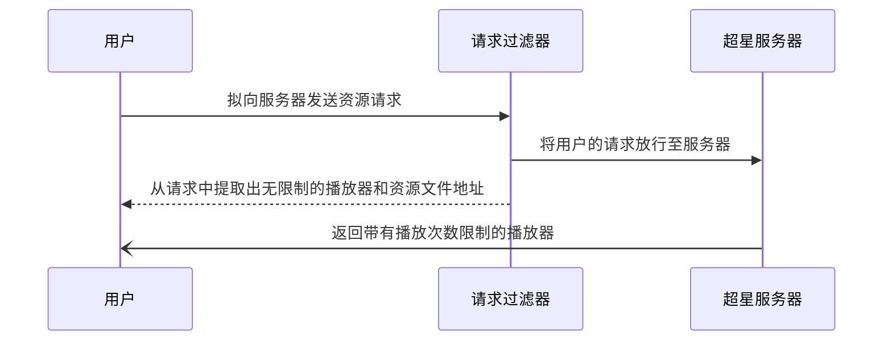
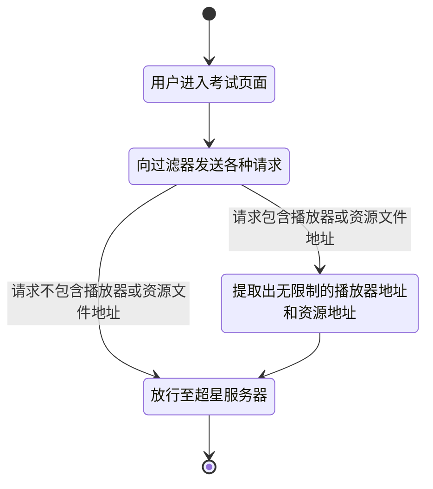
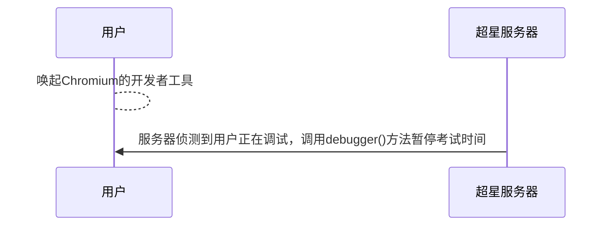

# ChaoXingAudioUnlock
基于CefSharp的解锁超星学习通音频播放次数和音频直链提取

# 简介

超星学习通音频解锁小助手是由本人原创，基于**CefSharp**实现的**学习通限制音频播放次数的解锁、音频资源源地址提取与暂停考试时间**。完全免费、开源，方便大家使用。

---

# 功能介绍

### 解锁音频播放次数限制

对于考试中老师设置了音频只能播放1次(n次)，万一没听清就无法再听了，此软件在进入考试页面会自动获取无限制的音频播放地址并展示在Container中

​​

### 音频资源源地址提取

可提取出当前考试/作业所有音频资源的源地址，使用源地址可下载资源、使用播放器自行播放等。

​​

此外，提取到的音频资源源地址还可以直接在Container中打开并播放

​​

### 考试时间暂停

通过CefSharp显示Chromium DevTools(开发者工具)来进入debugger模式实现暂停时间。但是否会被记录、检测暂时不详。

---

# 原理分析

### 解锁音频播放次数&资源地址提取

### 暂停考试时间

---

# 作者有话说

此项目非正式项目，只是在学习[CefSharp](https://github.com/cefsharp/CefSharp)这个库的用法的过程中的一个**学习练手项目**，因此不作为正式的项目提供Release版本下载，如确实有学习或使用的需要使用请从Github库中Clone下来并自行生成。

此外，本项目也无意侵犯超星公司的任何权利，如侵权请发送邮件至yyjpjs@gmail.com删除。
